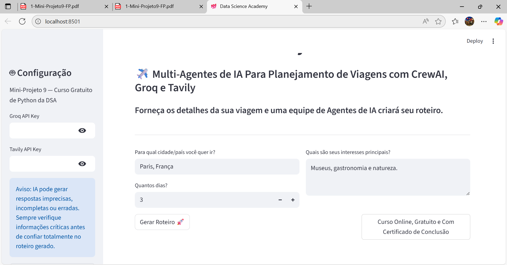

# Project-to-deploy-a-multi-agent-AI-app-for-travel-planning-using-CrewAI-Groq-and-Tavily

The project demonstrates, in practice, the complete deployment cycle of an intelligent application based on multi-agent AI, going beyond the simple inference of a model.

The solution integrates CrewAI for collaborative orchestration between agents, Groq for high-performance LLM execution, and Tavily as a web-connected search engine, allowing the application to plan trips autonomously and contextually.

Each agent assumes a specialized role (research, logistics planning, and final itinerary development), working sequentially to transform simple user inputs, such as destination, duration, and interests, into a structured and ready-to-use itinerary.

The project explores essential concepts for production applications, such as API integration, secure environment variables, task orchestration, decision automation, interactive experience via Streamlit, and best practices for organization in multi-agent systems.

The result is a system that combines "reasoning," external querying, planning, and content generation, representing a real-world example of how to architect, deploy, and scale agent-driven AI applications in practical, high-value scenarios.

# How to run the project

#### Open the terminal or command prompt, navigate to the folder with the files, and run the command below to create a virtual environment:

conda create --name env python=3.13

#### Activate the environment:

conda activate env (or: source activate env)

#### Install pip and dependencies:

pip install -r requirements.txt

#### Run the app:

streamlit run project_app.py

#### Use the commands below to deactivate the virtual environment and remove the environment (optional):

conda deactivate
conda remove --name env --all

